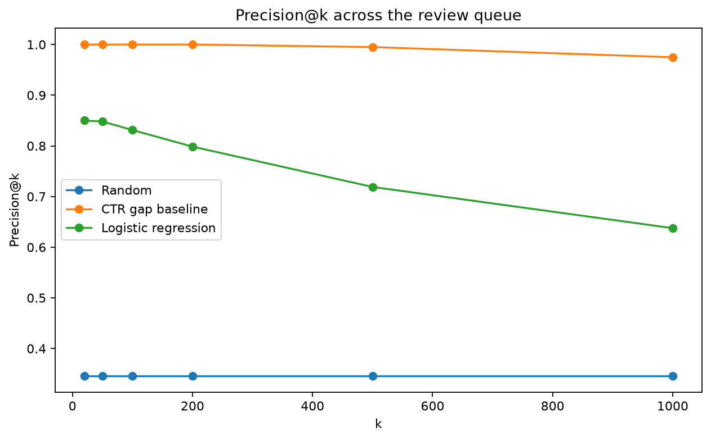

# CTR-Gap Review Queue: Prioritizing Pages for SEO Review

**Machine Learning Capstone · CTR / Engagement Opportunity Scoring**  
**Author:** Amjad Alami 
**Data window:** March 2026  
**Repository:** [T0othIess/FlyRank-AI-ML-internship](https://github.com/T0othIess/FlyRank-AI-ML-internship)

> **Headline result:** Across 50 client-grouped holdouts, the logistic-regression ranking averaged **85.00% Precision@20**, compared with a **34.65% random/base-rate mean**. Performance varied substantially by held-out clients, with Precision@20 ranging from **45% to 100%**, so this paper reports the average and the observed range rather than one favorable split.

## Abstract

This project asks which published pages receive lower click-through rate (CTR) than expected for comparable search positions, and which pages an SEO team should review first. Using March 2026 data from the FlyRank ML Internship warehouse, I aggregate daily search performance to one row per client-page pair and keep pages with at least 200 monthly impressions. I train a logistic regression using search-position and search-context features, with a tier-relative high-gap label whose expected CTR and threshold are rebuilt from training clients only. Across 50 client-grouped holdouts, the model averages **85.00% Precision@20** compared with a **34.65% random/base-rate mean**, while a deliberately strong label-informed CTR-gap baseline reaches **100.00% Precision@20**. The final output is a ranked queue for human SEO review, not a causal claim that changing a title, snippet, or page will improve CTR.

---

## Introduction / Problem statement

SEO teams can have far more published pages than they can manually review. Some pages appear in Google Search but receive fewer clicks than would be expected for pages appearing in similar positions.

The decision this project supports is simple:

**Which pages should be reviewed first?**

The unit of analysis is one `client_hash_id × content_hash_id` pair aggregated across March 2026. The output is not an automatic edit or a yes/no command. It is a **ranked review queue**.

A reviewer can use the queue to decide where to spend time checking things such as:

- title and meta-description quality;
- search-intent alignment;
- whether the content is still current;
- whether the observed CTR pattern still appears in newer data.

A wrong recommendation mostly costs review time: a false positive can send an editor toward a page that is actually performing normally, while a missed page can delay attention to a real CTR opportunity.

Because CTR depends heavily on search position, one universal CTR threshold is not a good comparison for every page. The modeling task therefore focuses on **CTR relative to comparable search-position tiers**.

---

## Data

### Source

The analysis uses the gated **FlyRank AI/ML Internship warehouse** hosted on Hugging Face.

Two tables are used:

| Table | Purpose |
|---|---|
| `fact_content_daily_performance` | Daily Google Search performance at the `report_date × client_hash_id × content_hash_id` grain |
| `dim_content` | Content/search context including `search_volume`, `competition_level`, and `main_intent` |

The tables are joined using `content_hash_id`.

### Date window and coverage

The development window is **March 1–31, 2026**. June 2026 is kept out of model and label development. I also avoid `fact_content_query_90d` because its 90-day window reaches into June.

March coverage:

| Measure | Value |
|---|---:|
| Daily performance rows | 9,841,378 |
| Rows with GSC data available | 3,611,061 |
| GSC availability | **36.69%** |

Daily rows are aggregated to one client-page row across the month.

The initial monthly aggregation produces **159,054 pages**. Earlier baseline work showed that extremely low-impression pages created noisy recommendations, so the final analysis requires at least **200 March impressions**. That leaves **82,507 eligible pages**.

### Filtering and public safety

Rows are excluded when GSC data is unavailable, the content is deleted, average search position is non-positive, or required search-context fields are missing.

The following fields are **not model features** because they define or directly reveal the outcome being evaluated:

- `total_clicks`
- `total_impressions`
- `ctr`
- `expected_ctr`
- `ctr_gap`
- `gap_threshold`
- `is_high_gap`

GA4/session/scroll fields and AI-referral fields are also excluded so the predictor stays focused on Google Search CTR and interpretable search context.

Hashed IDs are used for grouping and internal queue construction, not as model features. This public paper does not expose client names, domains, raw URLs, private queries, credentials, or raw warehouse exports.

---

## Methodology

### Monthly page-level dataset

Clicks and impressions are summed across March.

Average position is calculated with an impression-weighted average:

`weighted_avg_position = SUM(avg_position × impressions) / SUM(impressions)`

This reduces the influence of low-impression days on a page's monthly position estimate.

### Features

The final logistic regression uses:

- `weighted_avg_position`
- one-hot encoded `position_tier`
- `log_search_volume`
- `competition_level_enc`

The position tiers are:

| Tier | Weighted average position |
|---|---:|
| `page_1` | 0–10 |
| `striking` | 10–20 |
| `page_3_plus` | Above 20 |

Search volume is transformed with `np.log1p(search_volume)` because the raw values are strongly skewed.

Competition is encoded as:

`LOW = 0`, `MEDIUM = 1`, `HIGH = 2`.

### Target: a tier-relative CTR gap

Observed CTR is:

`ctr = total_clicks / total_impressions`

For each position tier, expected CTR is calculated from **training rows only**:

`expected_ctr = training clicks in tier / training impressions in tier`

Then:

`ctr_gap = expected_ctr - observed_ctr`

A larger positive gap means the page receives fewer clicks than its position-tier benchmark.

The final target is:

> `is_high_gap = 1` when a page's `ctr_gap` is greater than or equal to the **training-data 70th percentile for its own position tier**.

### Why the label changed

The first version used one flat rule: `ctr_gap >= 0.002`.

That failed for two reasons. First, different position tiers have different expected CTR levels; in the deepest tier, the old expected CTR was itself below `0.002`, making a positive label mathematically impossible. Second, the earlier expected-CTR calculation used the full dataframe before the train/test split.

The final pipeline fixes both problems by rebuilding expected CTR and the tier-specific threshold from **training rows only for every evaluation split**.

There is still a known tie effect: in the diagnostic training split, many zero-click `page_3_plus` pages share exactly the same gap at the percentile boundary. Because the label uses `>=`, the whole tie is included. I keep that behavior visible as a limitation rather than adding a more complicated tie-breaking rule.

### Model

The learned model is:

`LogisticRegression(max_iter=1000, random_state=1)`

Logistic regression keeps the model simple and produces a continuous class-1 score that can be used to rank pages.

### References used for comparison

The model is compared with two references on the same held-out rows:

1. **Random/base-rate reference** — the positive-label rate in that test split.
2. **CTR-gap baseline** — rank the test pages directly by observed `ctr_gap`, largest first.

The CTR-gap baseline is intentionally very strong because it directly sees a quantity used to construct the label. It is therefore a **label-informed reference**, not a realistic pre-click competitor.

### Validation

Validation is grouped by `client_hash_id` with `GroupShuffleSplit`.

Every page from one client stays entirely in train or entirely in test, so the same client never appears on both sides of a split.

Client sizes are highly uneven. `test_size=0.2` means roughly 20% of client groups, not 20% of rows, so the actual test-row percentage can vary sharply depending on which clients are held out.

Instead of selecting one convenient random seed, the final evaluation uses **50 grouped holdouts, seeds 1–50**. For every split, the pipeline rebuilds:

1. expected CTR from training rows;
2. the tier-specific 70th-percentile thresholds;
3. the labels;
4. the logistic regression model;
5. the model, baseline, and random Precision@k metrics on unseen clients.

The primary metric is **Precision@k** because the practical output is a ranked review queue.

---

## Results

### Mean performance across 50 grouped holdouts

| k | Random mean | CTR-gap baseline mean | Logistic regression mean | Model min–max |
|---:|---:|---:|---:|---:|
| 20 | 34.65% | 100.00% | **85.00%** | 45.00%–100.00% |
| 50 | 34.65% | 100.00% | **84.80%** | 52.00%–98.00% |
| 100 | 34.65% | 100.00% | **83.12%** | 47.00%–98.00% |
| 200 | 34.65% | 100.00% | **79.85%** | 42.50%–97.50% |
| 500 | 34.65% | 99.49% | **71.89%** | 33.40%–94.80% |
| 1000 | 34.65% | 97.48% | **63.76%** | 28.20%–91.20% |

The random/base-rate result itself changes between held-out client sets, ranging from **26.46% to 45.02%**, with a mean of **34.65%**.

At `k=20`, the model's **85.00% mean precision is about 2.45× the random mean**. Precision gradually declines deeper in the queue, which is expected for a prioritization system: the highest-scored pages are reviewed first, while later positions contain harder cases.

The CTR-gap baseline stays much stronger because it directly uses an outcome-derived quantity that participates in the label. Its near-perfect result should not be read as a deployable model benchmark.

### Precision@k chart



*Figure 1. Mean Precision@k across the 50 grouped holdouts. Random selection is the split base rate, the CTR-gap baseline is label-informed, and the logistic regression ranks pages without receiving clicks, CTR, expected CTR, or CTR gap as features.*

### Why the range matters

The model's Precision@20 ranges from **45% to 100%** across the 50 holdouts. Some clients contain far more eligible pages than others, so different unseen-client populations can be very different.

For that reason, the main claim is **85.00% mean Precision@20 with an observed range of 45%–100%**, not the result from one lucky split.

### Final out-of-sample queue

Only test-row predictions are saved during the repeated evaluation. When the same page appears in test across multiple seeds, its scores are averaged. Across the 50 splits, **100% of eligible pages receive at least one out-of-sample prediction**.

The combined queue should not be confused with the validation mean. In the final aggregated top 20, **15 of 20 pages have a majority high-gap label**, while 5 are kept as verification cases. That descriptive 15/20 composition is different from the **85.00% mean Precision@20**, which is the average across 50 separate held-out test rankings.

---

## Limitations & honest framing

This project is **descriptive and decision-support, not causal**. A highly ranked page is worth investigating; the analysis does not prove that changing its title, meta description, or content will improve CTR.

The high-gap target is a **heuristic proxy**, not an objective definition of a broken page. The 70th-percentile rule creates a practical review target inside each position tier, and tied values can make the positive share larger than the intended 30%.

In the diagnostic split, `page_3_plus` is the clearest example of this tie effect: many zero-click pages share the same gap at the threshold, so the whole tie is labeled positive.

Client-size imbalance is another major limitation. Different grouped holdouts can represent very different page populations, which is why Precision@20 spans 45%–100%. Each of the 50 splits contributes equally to the reported mean even though the number of held-out rows differs.

The final top 20 also concentrates entirely in `page_3_plus`. That is useful evidence about what the model prioritizes, but it is another reason not to treat the ranking score as a perfectly calibrated probability across every position range.

Only **36.69%** of March daily rows have GSC data available, and pages below 200 impressions are excluded. The results therefore do not apply to all published pages.

The analysis uses one month from one warehouse release. Monthly aggregation hides changes inside March, and the observed relationships may not generalize unchanged to other months or client populations.

Finally, the model is a first-pass logistic regression with a small feature set and minimal tuning. It is an internship research artifact, not a production-ready automatic decision engine.

---

## Ranked recommendations

The final queue is sorted by the page's **mean out-of-sample `predicted_high_gap` score** across the times its client was held out.

That score controls the ranking. The reason code only adds context.

Among majority high-gap pages in the final queue, the median search volume is **10**, which is used as a simple higher/lower search-demand split.

| Reason code | Meaning | Human action |
|---|---|---|
| `HIGH_PRIORITY_CTR_GAP` | Majority high-gap + higher search demand | Review first |
| `CTR_GAP_REVIEW` | Majority high-gap + lower search demand | Review |
| `MODEL_SCORE_ONLY_NOT_HIGH_GAP` | High model score, but most repeated labels do not confirm high-gap | Verify first |

The final top 20 contains:

| Queue group | Count |
|---|---:|
| `HIGH_PRIORITY_CTR_GAP` | 12 |
| `CTR_GAP_REVIEW` | 3 |
| `MODEL_SCORE_ONLY_NOT_HIGH_GAP` | 5 |

A reviewer should start at the top and work downward as time allows.

Useful checks include:

- title and meta description;
- search-intent match;
- content freshness;
- whether the CTR pattern still exists in newer data;
- whether the page has enough value to justify an edit.

The five `MODEL_SCORE_ONLY_NOT_HIGH_GAP` pages are deliberately **not hidden**. They show where the model's ranking and the repeated outcome-based labels disagree, so they should be checked before any action.

The queue should not automatically publish changes, rewrite content, or treat a high score as proof that a specific edit will work.

---

## Reproducibility

The full work is available in the public repository:

- **Repository:** [github.com/T0othIess/FlyRank-AI-ML-internship](https://github.com/T0othIess/FlyRank-AI-ML-internship)
- **Final capstone notebook:** [work/notebooks/capstone.ipynb](https://github.com/T0othIess/FlyRank-AI-ML-internship/blob/main/work/notebooks/capstone.ipynb)
- **Capstone report:** [work/capstone_report.md](https://github.com/T0othIess/FlyRank-AI-ML-internship/blob/main/work/capstone_report.md)

The analysis uses Python with DuckDB, pandas, NumPy, scikit-learn, matplotlib, and `huggingface_hub`.

To reproduce the analysis:

```bash
git clone https://github.com/T0othIess/FlyRank-AI-ML-internship.git
cd FlyRank-AI-ML-internship
python -m pip install -r requirements.txt
```

Set a Hugging Face read token with access to the gated FlyRank internship warehouse, then open:

```text
work/notebooks/capstone.ipynb
```

and run it from top to bottom.

The final evaluation uses `GroupShuffleSplit` seeds **1 through 50** and `LogisticRegression(random_state=1, max_iter=1000)`.

The notebook generates the final queue and paper tables under `work/outputs/`:

- `action_queue_final.csv`
- `capstone_precision_summary.csv`
- `capstone_top100_review_queue.csv`

The Precision@k chart is generated by the capstone and the copy used by this deployed paper is stored at:

- `work/figures/capstone_precision_at_k.png`

June 2026 is not used for the reported model development or validation, and this paper does not claim a sealed June holdout result.

---

## Acknowledgments & data credit

**Built on the [FlyRank ML Internship dataset](https://flyrank.ai).**

This capstone was completed as part of the FlyRank AI/ML Internship using the gated internship warehouse. Public results are presented with anonymized or aggregate information and are framed as observed, measured, directional, and decision-support evidence rather than causal proof.
