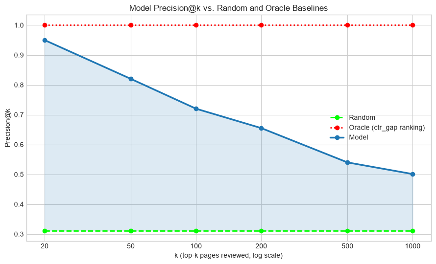

# CTR-Gap Review Queue: Prioritizing Under-Performing Pages Using Pre-Click Search Signals

## Abstract

This project asks: of published pages with Google Search Console data, which pages have lower CTR than expected for their position, and which should be prioritized for review? Using one month of FlyRank ML Internship warehouse data (March 2026), I define a high-gap label (`ctr_gap ≥ 0.002`) and compare an oracle baseline (ranking by `ctr_gap`) to a logistic regression model that uses only pre-click features (`weighted_avg_position`, one-hot `position_tier`, `log_search_volume`, ordinal `competition_level`). On a held-out 20% test split, the final model achieves 95% precision at k=20 and 72% at k=100, greatly enriching for true high-gap pages over the 31% base rate. The output is a ranked review queue to support SEO decisions about titles, meta descriptions, and content refresh, not a causal claim that specific changes will improve CTR. This work is descriptive, decision-support, and designed as a prioritization tool for human review.

---

## Introduction / Problem statement

SEO teams working with large content sites face a constant problem: many pages appear in Google Search results but get far fewer clicks than similar pages in comparable positions. Manually reviewing all pages is impossible, so the key decision is: **which pages should be reviewed first** for potential improvements to titles, meta descriptions, or content?

This project addresses that decision by building a **prioritization tool**: a ranked queue of pages that are most likely to be under-performing in CTR relative to their position. The tool is designed to support human review, not to automate changes or claim causal effects.

---

## Data

**Release used:**  
The capstone uses the FlyRank AI ML internship warehouse release on Hugging Face at `hf://datasets/FlyRank/internship-warehouse`.

**Tables used:**  
- `fact_content_daily_performance`: provides performance data at the `report_date × client_hash_id × content_hash_id` grain.  
- `dim_content`: provides search context fields such as `competition_level`, `search_volume`, and `main_intent`.  

The two tables are joined using `content_hash_id` for the selected date window.

**Date window:**  
- March 2026 (`month=2026-03`).  
- June 2026 exists in the warehouse but is treated as a sealed month and not used for model development.

**Exclusions and why:**  
- `gsc_clicks` and `gsc_impressions` are excluded as model features because they are used to calculate CTR and CTR gap; using them would be leakage.  
- GA4, session, AI-referral, and scroll-event fields are excluded because they measure activity after a user clicks, making them downstream of the CTR decision.  
- Client names and raw URLs are excluded from public outputs to follow the capstone’s public-data rule.

---

## Methodology

**Assumptions:**  
- CTR is derived by search position: pages in better positions should, on average, get higher CTR.  
- Pages with very low impressions are noisy, so they are filtered out before modeling.  
- Pages with much lower CTR than the expected CTR for their position tier are candidates for review.  
- The unit of analysis is `(client_hash_id × content_hash_id)` aggregated over March 2026.

**Features:**  
- `weighted_avg_position`  
- `position_tier` (one-hot encoded: `page_1`, `striking`, `page_3_5`)  
- `log_search_volume` (i.e., `np.log1p(search_volume)`)  
- `competition_level_enc` (ordinal: LOW=0, MEDIUM=1, HIGH=2)  

**Label definition:**  
The label is `is_high_gap = 1` for pages with `ctr_gap ≥ 0.002`, where `ctr_gap = expected_ctr - actual_ctr`. Larger `ctr_gap` means the page is under-performing for its position.

**Baseline:**  
- Score each page by `ctr_gap` alone.  
- Rank pages from largest `ctr_gap` to smallest.  
- Treat the top of this list as the priority review queue (oracle baseline).

**Validation design:**  
- Evaluation is at the page level: each row is one `(client_hash_id × content_hash_id)` pair aggregated over March 2026.  
- The split is train/test with an 80/20 random split and a fixed seed.

**Leakage checks:**  
- `total_clicks`, `total_impressions`, `ctr`, and `expected_ctr` are not used as features; they are only used to define the label.  
- No post-click metrics are used as features.

---

## Results

**Evaluation metric:**  
Precision@k for k = 20, 50, 100, 200, 500, 1000, comparing:
- Random selection (base rate ≈ 31%).  
- Oracle baseline (100% by construction).  
- Final logistic regression model.

**Precision@k table:**

| k    | Random precision@k | Baseline precision@k | Final Model precision@k |
|------|--------------------|----------------------|-------------------------|
| 20   | 31.1%              | 100.0%               | 95.0%                   |
| 50   | 31.1%              | 100.0%               | 82.0%                   |
| 100  | 31.1%              | 100.0%               | 72.0%                   |
| 200  | 31.1%              | 100.0%               | 65.5%                   |
| 500  | 31.1%              | 100.0%               | 54.0%                   |
| 1000 | 31.1%              | 100.0%               | 50.1%                   |

**Precision@k chart:**

The chart compares random selection, the oracle baseline, and the final logistic-regression ranking across review-queue sizes.

**Interpretation:**  
- At the top of the queue (k=20), 95% of pages flagged by the model are truly high-gap, versus about 31% if pages were selected at random.  
- Precision declines at larger k, which is expected and acceptable: the SEO team primarily uses the top of the queue, where the model is most accurate.

---

## Limitations & honest framing

This work is descriptive and decision-support, not causal. It shows which pages are associated with low CTR relative to their position, but it does not prove that changing a title, meta description, or content will cause CTR to improve.

The baseline ranks by `ctr_gap` itself, so it is an oracle by construction: it uses the exact quantity that defines the label (`is_high_gap`). The logistic regression model approximates this ranking using only pre-click features, without seeing `ctr_gap` directly.

The analysis uses one warehouse release (FlyRank ML Internship) and one month (March 2026). Only about 37% of warehouse rows have GSC data available; the rest are invisible to this analysis. Results may not generalize to other sites, time periods, or feature sets. The model is a single logistic regression with limited tuning (search over a few C values and feature encodings), not a production-ready system.

Low-impression noise was reduced by filtering to pages with at least 200 impressions and using a weighted average position (weighted by impressions), but some residual noise may remain, especially near the threshold. This work should be treated as a prioritization tool for human review, not a final decision engine.

---

## Ranked recommendations

This section turns the model’s ranking into a practical review playbook for an SEO team. The top pages by predicted probability of being high-gap are those the model suggests reviewing first for potential CTR improvement.

**How to use this queue:**  
- Start from the top of the list and work downward as time allows.  
- Pages near the top combine a high predicted probability of being high-gap with strong search visibility: most are in the `page_1` position tier, many with substantial search volume and low or medium competition.  
- Typical actions include reviewing and testing alternative titles and meta descriptions, checking search-intent alignment, and considering a content refresh.

The model is most useful at the top of the queue: on the test split, 95% of the first 20 pages and 72% of the first 100 pages are true high-gap pages, compared with a base rate of about 31%. This list is a prioritization tool, not a guarantee: human review is still required to decide which changes are appropriate for each page.

---

## Reproducibility

All analysis and modeling are implemented in a public Jupyter notebook:

- **Capstone notebook:** `work/notebooks/capstone.ipynb` in this repository.  
- **Repository:** [https://github.com/T0othIess/FlyRank-AI-ML-internship](https://github.com/T0othIess/FlyRank-AI-ML-internship)

The notebook loads data from the FlyRank ML Internship warehouse on Hugging Face, constructs a page-level dataset for March 2026, defines the `is_high_gap` label, trains a logistic regression model, and evaluates it against an oracle baseline using precision@k. Running the notebook end-to-end reproduces the tables and results reported in this paper.

---

## Acknowledgments & data credit

This project was built using the FlyRank ML Internship dataset and warehouse.  
**Data source:** FlyRank AI ML internship warehouse on Hugging Face.  
**More about FlyRank:** [https://flyrank.ai](https://flyrank.ai)